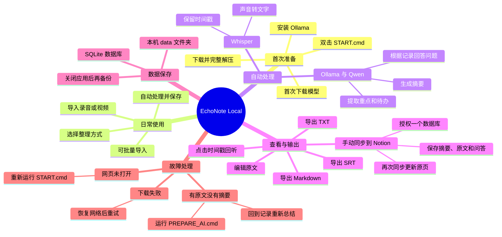

# EchoNote 功能与使用思维导图

```mermaid
mindmap
  root((EchoNote Local))
    首次准备
      下载并完整解压
      双击 START.cmd
      安装 Ollama
      首次下载模型
    日常使用
      导入录音或视频
      可批量导入
      选择整理方式
      自动处理并保存
    自动处理
      Whisper
        声音转文字
        保留时间戳
      Ollama 与 Qwen
        生成摘要
        提取重点和待办
        根据记录回答问题
    查看与输出
      点击时间戳回听
      编辑原文
      导出 Markdown
      导出 TXT
      导出 SRT
      手动同步到 Notion
        授权一个数据库
        保存摘要、原文和问答
        再次同步更新原页
    数据保存
      本机 data 文件夹
      SQLite 数据库
      关闭应用后再备份
    故障处理
      网页未打开
        重新运行 START.cmd
      有原文没有摘要
        运行 PREPARE_AI.cmd
        回到记录重新总结
      下载失败
        恢复网络后重试
```

图文版见 [操作说明图片](images/echonote-guide.png)。

处理中可关闭浏览器标签；保留启动窗口，并避免电脑休眠。
